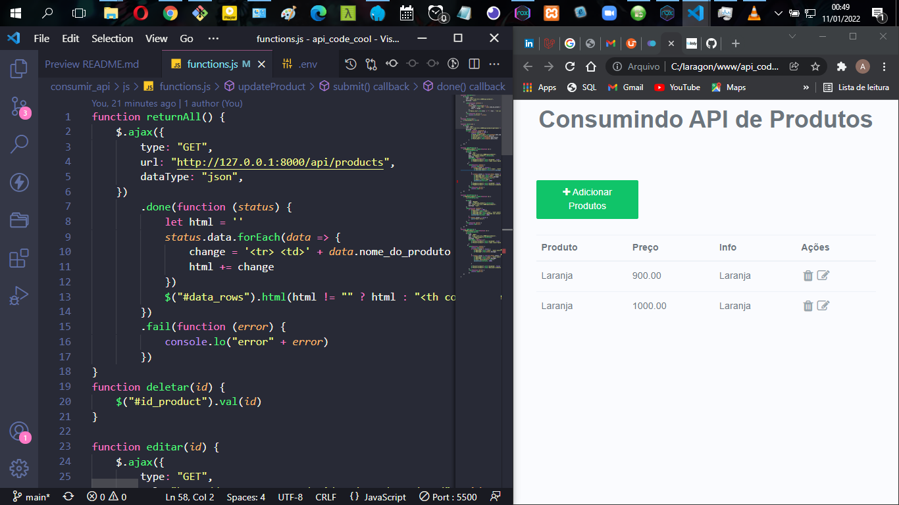

# Consumindo API Laravel 8 com jQuery
## Stack utilizadas
 `PHP 7 | Laravel 8 | Bootstrap 4 | jQuery | MySQL | HTML`
## Como instalar o projecto 
  <li>
    Fazer o Git Clone
  </li>
  <li>
        Abra o terminal no index da raiz do projecto `composer install or composer update` 
  </li>
  <li>
        Depois só rodar no terminal `php artisan key:generate`
  </li>
  
   <li>
        Agora cria uma Base de dados como nome `product_api`
  </li>

   <li>
        Abra o terminal no index da raiz do projecto e digite `php artisan migrate`
  </li>

  ## Como rodar o projecto 
    No terminal execute o codigo

    php artisan serve

    Depois o Directorio consumir_api/

    E abra o Arquivo index.html

  <b>
  OBS:
  </b> Não use o Live Server

  
  

    Visualização: 
  

  
